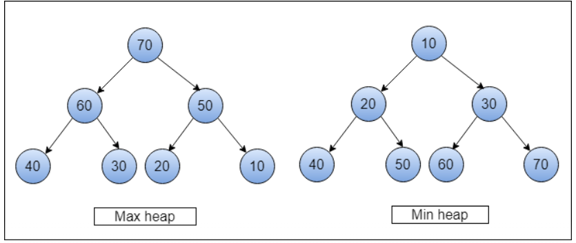

### Heap

- max binary heap

  - complete binary tree (왼쪽부터 원소를 채워나감)
  - 노드의 자식들은 부모보다 작아야 함

  

- list를 사용해 나타내기

  - 부모의 인덱스가 n일때,
    - left child 인덱스 : 2n+1,
    - right child 인덱스 : 2n+2
  - 자식의 인덱스가 n일 때,
    - 부모의 인덱스 : Math.floor((n-1)/2)

- insert new node

  - 배열의 마지막에 push
  - 조건에 맞는 위치가 될때까지 bubbling up
    - 부모 노드와 비교해서 swap

- shift max node
  - max binary heap의 root가 제일 큰 값
  - 배열에서 shift() 이후에, 배열의 가장 마지막 값을 인덱스 0에 넣어준 후, sink down 작업
    - 자식 노드와 비교해서 swap

```js
class MaxHeap {
  constructor() {
    this.heap = [];
  }

  // Helper Methods
  getLeftChildIndex(parentIndex) {
    return 2 * parentIndex + 1;
  }
  getRightChildIndex(parentIndex) {
    return 2 * parentIndex + 2;
  }

  getParentIndex(childIndex) {
    return Math.floor((childIndex - 1) / 2);
  }

  hasLeftChild(index) {
    return this.getLeftChildIndex(index) < this.heap.length;
  }

  hasRightChild(index) {
    return this.getRightChildIndex(index) < this.heap.length;
  }

  hasParent(index) {
    return this.getParentIndex(index) >= 0;
  }

  leftChild(index) {
    return this.heap[this.getLeftChildIndex(index)];
  }

  rightChild(index) {
    return this.heap[this.getRightChildIndex(index)];
  }

  parent(index) {
    return this.heap[this.getParentIndex(index)];
  }

  swap(indexOne, indexTwo) {
    const temp = this.heap[indexOne];
    this.heap[indexOne] = this.heap[indexTwo];
    this.heap[indexTwo] = temp;
  }

  peek() {
    if (this.heap.length === 0) {
      return null;
    }
    return this.heap[0];
  }

  // Removing an element will remove the
  // top element with highest priority then
  // heapifyDown will be called
  remove() {
    if (this.heap.length === 0) {
      return null;
    }
    const item = this.heap[0];
    this.heap[0] = this.heap[this.heap.length - 1];
    this.heap.pop();
    this.heapifyDown();
    return item;
  }

  add(item) {
    this.heap.push(item);
    this.heapifyUp();
  }

  heapifyUp() {
    let index = this.heap.length - 1;
    while (this.hasParent(index) && this.parent(index) < this.heap[index]) {
      this.swap(this.getParentIndex(index), index);
      index = this.getParentIndex(index);
    }
  }

  heapifyDown() {
    let index = 0;
    while (this.hasLeftChild(index)) {
      let largerChildIndex = this.getLeftChildIndex(index);
      if (
        this.hasRightChild(index) &&
        this.rightChild(index) > this.leftChild(index)
      ) {
        largerChildIndex = this.getRightChildIndex(index);
      }
      if (this.heap[index] > this.heap[largerChildIndex]) {
        break;
      } else {
        this.swap(index, largerChildIndex);
      }
      index = largerChildIndex;
    }
  }

  printHeap() {
    var heap = ` ${this.heap[0]} `;
    for (var i = 1; i < this.heap.length; i++) {
      heap += ` ${this.heap[i]} `;
    }
    console.log(heap);
  }
}

// Creating the Heap
var heap = new MaxHeap();

// Adding The Elements
heap.add(10);
heap.add(15);
heap.add(30);
heap.add(40);
heap.add(50);
heap.add(100);
heap.add(40);

// Printing the Heap
heap.printHeap();

// Peeking And Removing Top Element
console.log(heap.peek());
console.log(heap.remove());

// Printing the Heap
// After Deletion.
heap.printHeap();
```

### priority queue

- 각 요소가 우선순위를 가지는 데이터 구조
- 높은 우선순위를 가진 노드가 먼저 처리됨
- priority queue는 추상적인 개념이고, heap, array list로도 생성할 수 있음
- binary heap을 사용하면 삽입, 삭제 성능이 좋음
  - insertion : O(logN)
  - removal : O(logN)
  - search : O(N) - sibling 사이에 규칙이 없기 때문에 탐색 시 좁혀나갈 수 없고, 전체 탐색을 해야함
